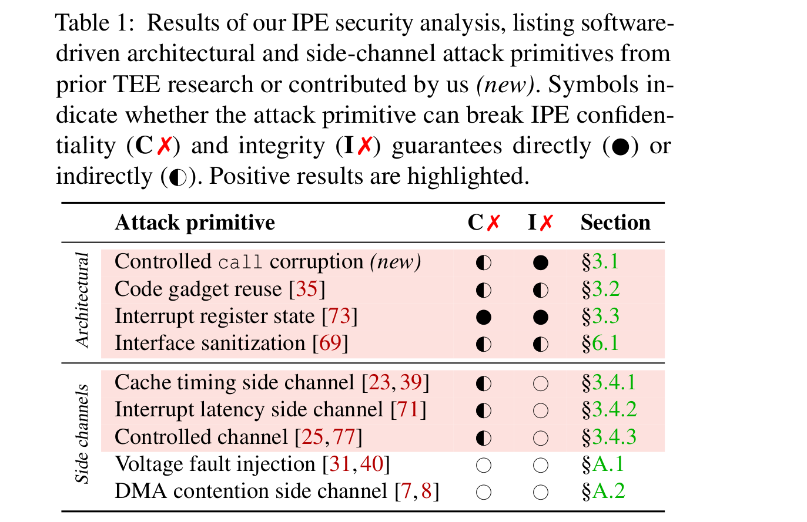

# IPE attack primitives

This directory contains minimal, standalone proof-of-concept programs to showcase the different attack primitives described in Section 3 of the paper and summarized in Table 1.



## Subdirectory structure

Attack primitives are organized in hierarchical subdirectories as per Table 1 and MSP430 device number.

The subdirectory for the novel _controlled call corruption_ primitive, also includes the reported negative results.

## Running the programs

Refer to the top-level README on how to import and run the CCS projects with IPE enabled.

Every project contains a README with the expected output. For the architectural attack primitives, this should print the secret value 1337 (whereas reading directly yields the dummy value 0x3ff):

```
Secret directly: 3fff, storage: 1337
```

For the side-channel attack primitives, the expected output shows that different behaviors can be distinguished.