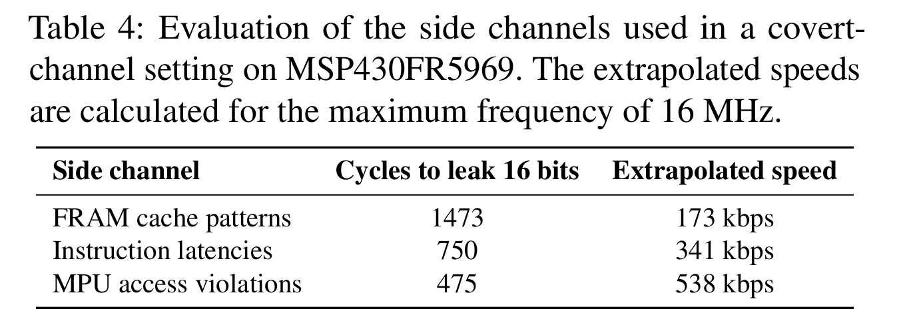

# IPE covert-channel setup

This directory contains the code for the different covert-channel evaluation setups discussed in Section 3.4 of the paper. Covert-channel evaluation results for the MSP430FR5969 device are summarized in Table 4.

