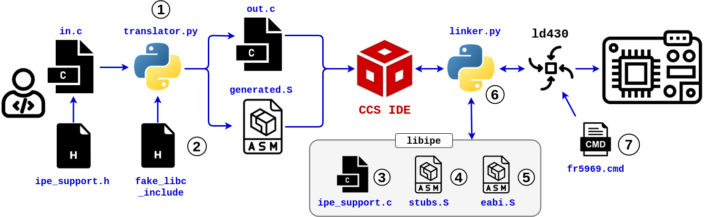

# Software mitigation framework

This directory contains the source code for our software framework to improve the security of IPE projects.

## Overview

Our framework consists of a collection of assembly and C code files and a source-to-source translation script.
The developer is responsible for adding intuitive `IPE_ENTRY`, `IPE_FUNC`, and `IPE_DATA` C preprocessor annotations in the source code to define the (entry) functions and data objects that are to be protected.
This source file can then be applied to our translator Python script, which will generate additional assembly stubs and a slightly modified C source code, all of which compiled together with C and assembly support libraries will produce a protected binary. Finally, before linking with a custom linker script, another Python script intercepts any relocations to compiler-inserted functions, transparently redirecting them to trusted, intra-IPE counterparts.



## Directory structure

Individual components in the `framework` directory are identified in the figure above:

1. **translator.py:** A minimal source-to-source translator that uses the Python [`pycparser`](https://github.com/eliben/pycparser) package to process the abstract syntax tree of an input C file and produce a slightly modified output C file, plus generated assembly glue stubs.
2. **Libc headers:** Dummy libc header files copied verbatim from the `pycparser` project and need to run the C preprocessor before applying our source-to-source translation.
3. **Trusted support library:** The files `libipe/ipe_support.{c,h}`, which contain C preprocessor macros and helper function to be included in the IPE protection domain.
4. **Trusted stubs:** Small, hand-written assembly stubs in `libipe/stubs` that will be called on context switches to/from IPE to transparently apply sanitizations and configure MPU protection.
5. **EABI stubs:** Secure, intra-IPE variants of arithmetic compiler support routines, in `libipe/ipe_eabi`, copied verbatim from TI's MSP430 CGT support library (included in the CCS distribution).
6. **linker.py:** Convenient wrapper script to replace the original MSP430 linker executable (e.g., as specified in the CCS IDE build configuration). This script uses the Python [`pyelftools`](https://github.com/eliben/pyelftools) package to intercept any compiler-generated arithmetic support routines, transparently redirecting them to secure intra-IPE counterparts, as well as compiles + links our custom IPE support library.
9. **Linker script:** The file `lnk_msp430fr5969.cmd` that defines the IPE memory layout and ensures all stubs are included correctly.

## Installation

Install [`pycparser`](https://github.com/eliben/pycparser) and [`pyelftools`](https://github.com/eliben/pyelftools) as follows:

```shell
pip install -r framework/requirements.txt --no-deps
```

## General workflow

We provide a concrete sample CCS project in `security_eval`. In general, the workflow to use our framework for your own projects is as follows:

1. Manually invoke the `translator.py` script on your C source file that contains the IPE function and data definitions. This will generate assembly stubs and a modified C file in the specified output directory. Syntax and arguments are as follows:

```
 ./translator.py --help
usage: translator.py [-h] -ccs CCS [-output OUTPUT] source_file

Source-to-source translator for IPE security

positional arguments:
  source_file

optional arguments:
  -h, --help      show this help message and exit
  -ccs CCS        Path to the CCS directory on your system (e.g., /home/user/ti/ccs1230/ccs).
  -output OUTPUT  Path to the output file directory (default: ./output/).
```

2. Replace the IPE functions with the generated variants and include `generated_ipe_header.h` in your original source file.

3. Add the generated assembly stubs to the list of compiled files in your CCS project.

4. If using the `ipe_support.h` header, point the CCS IDE to the (relative) include path, e.g., `${CCS_PROJECT_DIR}/../../framework`  via "Build Options > MSP430 Compiler > Include Options".


5. Configure the CCS IDE to use our wrapper `linker.py` script as the default MSP430 linker via "Build Options > MSP430 Linker > Command".


## Copyright notices

* The files in `fake_libc_include` are copied verbatim from the [`pycparser`](https://github.com/eliben/pycparser) project.
* The files in `ipe_eabi` were copied from [Texas Instruments' MSP430 Code Generation Tools v21.6.1.LTS](https://www.ti.com/tool/MSP-CGT) (installed by default as part of the CCS IDE under `~/ti/ccs1260/ccs/tools/compiler/ti-cgt-msp430_21.6.1.LTS`) and minimally modified to be included in the IPE-protected text section.