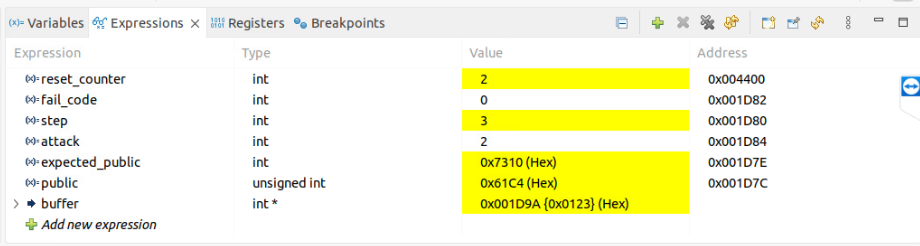
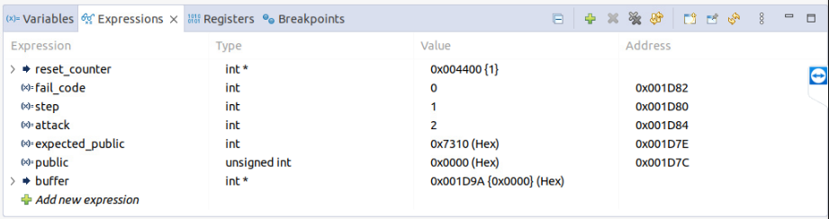

# Effectiveness of the software mitigation framework

This directory contains a CCS project with a minimal IPE program that demonstrates all three architectural attack primitives: arbitrary jump, arbitrary interrupt, and controlled call corruption. It can, thus, be used to validate that our mitigation framework successfully blocks the attacks.

## Attention points

* As this test attack program corrupts memory locations, it cannot be re-ran multiple times without re-uploading (i.e., stopping and starting a new CCS debug session). You can select the attack type by setting the global variable `attack` in `main.c` (1=jump; 2=IRQ; 3=call).

* When running with the MPU protection enabled, the console detaches on resets. Thus, we cannot rely on `printf` statements to show the outcome. Instead, after running the program for a while, press pause ( :pause_button: ) and switch to the "Expressions" pane in the CCS debugger to manually inspect the values of `step`, `fail_code`, `buffer`, `public`, and  `expected_public` (as illustrated in the screenshots below).

* `victim.c` explicitly includes a multiplication to make sure the compiler will insert a call to the `__mspabi_mpyi` helper function, which is transparently intercepted and redirected to a secure `__ipe___mspabi_mpyi` variant by our framework.

* The CCS project already sets the include path and linker command, as explained in [../README.md](../README.md).

## Expected output

Example output for a successful IRQ attack (`demo_all` with `attack=2`):



Example output for an unsuccessful IRQ attack (`demo_all_mitigated` with `attack=2`):



## Generating the `demo_all_mitigated` project

The `demo_all` directory contains a vulnerable CCS project _without_ MPU mitigations. We also include the auto-generated `demo_all_mitigated` CCS project that has all mitigations included for reference. 

To re-generate the mitigated project copy manually, proceed as follows:

```
$ ./run.sh 
.. copying base 'demo_all' CCS project to 'demo_all_mitigated'
.. sanity-check CCS project configuration
	L_ searching for libipe    in file: demo_all_mitigated/.cproject [OK]
	L_ searching for linker.py in file: demo_all_mitigated/.cproject [OK]
.. running translator.py
.. fixing victim.c
.. generating diff summary
	L_ Files demo_all/call_attacker.s and demo_all_mitigated/call_attacker.s differ
	L_ Only in demo_all: Debug
	L_ Only in demo_all_mitigated: generated_ipe_header.h
	L_ Only in demo_all_mitigated: generated_stubs.s
	L_ Only in demo_all_mitigated: generated_table.s
	L_ Files demo_all/irq_attacker.s and demo_all_mitigated/irq_attacker.s differ
	L_ Files demo_all/jump_attacker.s and demo_all_mitigated/jump_attacker.s differ
	L_ Files demo_all/.project and demo_all_mitigated/.project differ
	L_ Files demo_all/victim.c and demo_all_mitigated/victim.c differ
.. all done; ready to import 'demo_all_mitigated' as a new CCS project!
```
