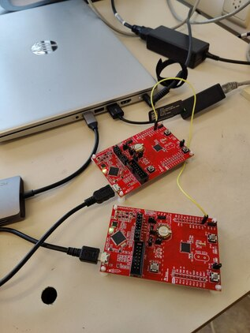

# Benchmarks software mitigation framework

To assess the individual overhead contributions of the different components introduced by our framework, we performed a series of microbenchmarks.
Furthermore, as an end-to-end macrobenchmark, we ported a representative embedded enclaved application, [VRASED's](https://github.com/sprout-uci/vrased) memory attestation  using the HACL* cryptographic library, to the MSP-EXP430FR5969 board.

## Directory structure

- `timer/`: board-specific projects to time events from another connected board over GPIO.
- `software-bor/`: board-specific  projects that repeatedly trigger a software brown-out reset that can be timed as a microbenchmark.
- `hmac/`: the project used for our macrobenchmark, HMAC code attestation.
- `measurements/`: raw timing measurements obtained during our experiments and an evaluation script to compute average and standard deviation.

## Measurement setup


Our experimental setup for benchmarking programs involves connecting two MSP430 boards with a physical wire to enable communication between them.
Specifically, one board will run a dedicated timer program (in the `./timer/` directory), while the other board will toggle GPIO signals to indicate the start and end times of the benchmarked program.

The physical setup with two connected MSP-EXP430FR5969 boards is shown below:



### Setting up the CCS IDE

> :warning: To simultaneously debug multiple devices, multiple instances of CCS need to be launched with different workspaces selected.

> :warning: Because of an [MSP-EXP430FR5969 CPU bug](https://e2e.ti.com/support/tools/code-composer-studio-group/ccs/f/code-composer-studio-forum/1098582/msp430fr2155), the `timer` project will unfortunately pause the debugger on every `printf` statement. Hence, you need to manually resume (F8, :arrow_forward:) the `timer` program several times to see the measurements output in the CCS console.

Import the two projects in the two separate workspaces, and launch the debug sessions from there.
For the `timer` project, you will have the change the port used for debugging, this can be done via "Project > Properties > General > Connection".
Select `TI MSP430 USB2` for the `timer` project.


## Macrobenchmark: Memory attestation timing

### IPE-only

> As an end-to-end benchmark, we measured the average execution time of attesting the entire RAM (2 kB). Running at 8 MHz, the attestation takes 497.0777 ms (n = 100, σ = 0.0149) with only IPE protection.

Example output when running the `hmac/base_attestation/` and `timer/timer_5969` projects on two connected MSP-EXP430FR5969 boards:

```
timer: listening for interrupts on P1.3 (make sure to hit resume for every subsequent print statement in the debugger)..
printing measurements (copy-paste the line below into a CSV file):
79529f,795304,795301,7954c4,7953f6,7952be,79535c,79541c,79532c,795287,79533c,7953a7,795337,7953a3,7953ec,795479,795366,795288,79528f,7951e2,795211,79527f,79521b,795293,7951e2,795162,795265,7952b0,795250,7951a1,79518e,79527f,7952ed,795334,795363,795382,795466,7953ae,795358,7952b4,7953ac,7952c2,7952cf,79528c,795226,7952ff,795299,795217,79534d,79539f,7953b6,795479,79546a,7954cd,7954ea,7955cd,795591,7955bd,7955b9,79554b,7954aa,7953c5,79545e,7954ed,795570,7955b4,795559,7955bb,79556e,7955fa,7955c0,7954c8,7954e9,795518,795482,79558b,795541,7953b0,7953a7,795462,7953fd,795456,7953e0,79545c,795495,79541e,79535a,795312,795419,7953d8,79540a,795388,7952ab,795459,7953d1,795453,79538d,795351,795340,7951b0,
all done! exiting..
```

Now copy the line with the numbers verbatim into a CSV file and run the calculator script as follows:

```
ipe-exposure/06_benchmarks/measurements$ ./calculator.py hmac_base.csv
Mean: 496.9553 ms
Stdv: 0.018305 ms
```

This indeed closely corresponds to the reported numbers (small deviations are expected).

### IPE + MPU software mitigation framework

> Using our framework to protect this vulnerable implementation, the execution time increases to 497.7123 ms (n = 100, σ = 0.0182), an overhead of 634.6 μs (0.13%).

Example output when running the `hmac/translated_attestation/` and `timer/timer_5969` projects on two connected MSP-EXP430FR5969 boards:

```
timer: listening for interrupts on P1.3 (make sure to hit resume for every subsequent print statement in the debugger)..
printing measurements (copy-paste the line below into a CSV file):
797d3e,797d37,797d1d,797cce,797cd5,797d3c,797c67,797c35,797bed,797d3e,797d22,797c08,797cc0,797cea,797ce3,797d3a,797e33,797da6,797e26,797cb8,797dca,797cbe,797c6c,797cf1,797d45,797d1b,797c91,797c08,797c76,797d29,797ccb,797d6b,797db4,797d90,797cb2,797cfa,797ccc,797d10,797e0f,797eb1,797d51,797d68,797d8d,797c8d,797d4e,797d61,797deb,797dd3,797d04,797d6f,797dbe,797e6b,797e85,797d6f,797dcc,797e07,797d40,797d27,797dbc,797cb4,797d1b,797d29,797d89,797e35,797f0a,797f1a,797ecd,797f21,797dd8,797e51,797e09,797d30,797c5f,797d22,797cb1,797cb3,797c15,797c6c,797ce3,797d30,797dfd,797e5b,797d94,797d22,797d99,797d30,797da7,797da7,797d4a,797cc9,797c9b,797da7,797ce5,797c47,797c76,797cdb,797c66,797d60,797cce,797e41,
all done! exiting..
```

Now copy the line with the numbers verbatim into a CSV file and run the calculator script as follows:

```
ipe-exposure/06_benchmarks/measurements$ $ ./calculator.py hmac_trans.csv
Mean: 497.6205 ms
Stdv: 0.011167 ms
```

This indeed closely corresponds to the reported numbers (small deviations are expected).

## Microbenchmark: Software brown-out reset timing


Example output when running the `software-bor/software-bor_5969` and `timer/timer_5969` projects on two connected MSP-EXP430FR5969 boards:

```
timer: listening for interrupts on P1.3 (make sure to hit resume for every subsequent print statement in the debugger)..
printing measurements (copy-paste the line below into a CSV file):
015b2,015b5,015b3,015b6,015b5,015b3,015b6,015b5,015b7,015b3,015b6,015b5,015b7,015b2,015b5,015b7,015b2,015b5,015b7,015b2,015b7,015b5,015b3,015b6,015b5,015b2,015b7,015b5,015b3,015b6,015b5,015b7,015b2,015b5,015b7,015b2,015b5,015b7,015b2,015b7,015b5,015b2,015b7,015b5,015b2,015b5,015b3,015b6,015b5,015b3,015b6,015b5,015b2,015b7,015b5,015b2,015b7,015b5,015b2,015b7,015b5,015b2,015b7,015b5,015b3,015b6,015b5,015b7,015b2,015b5,015b7,015b2,015b5,015b7,015b2,015b5,015b3,015b6,015b5,015b2,015b7,015b5,015b2,015b5,015b3,015b6,015b5,015b2,015b5,015b7,015b2,015b5,015b3,015b6,015b5,015b2,015b5,015b7,015b2,015b5,
all done! exiting..
```

Now copy the line with the numbers verbatim into a CSV file and run the calculator script as follows:

```
ipe-exposure/06_benchmarks/measurements$ ./calculator.py 5969_bor.csv
Mean: 0.3473 ms
Stdv: 0.000114 ms
```

This indeed closely corresponds to the reported numbers for the MSP-EXP430FR5969 device: mean=347.3μs; stdev=0.109 μs (small deviations are expected).

## Microbenchmark: Stub instruction timings


The reported cycle numbers were obtained using the `start_timer` and `stop_timer` [macros](../05_framework/framework/libipe/stubs/macros.s) that can be uncommented in the [ipe-protected.s](../05_framework/framework/libipe/stubs/ipe-protected.s) and [mpu-protected.s](../05_framework/framework/libipe/stubs/mpu-protected.s) assembly stubs to measure the execution time of selected code snippets using the onboard MSP430  `Timer_A` peripheral.
See [measurements/stub_timings.md](measurements/stub_timings.md) for the calculation details of how these timings lead to the reported cycle numbers.
Note that execution timings are deterministic on MSP430 embedded microcontrollers, so no averages are needed.
