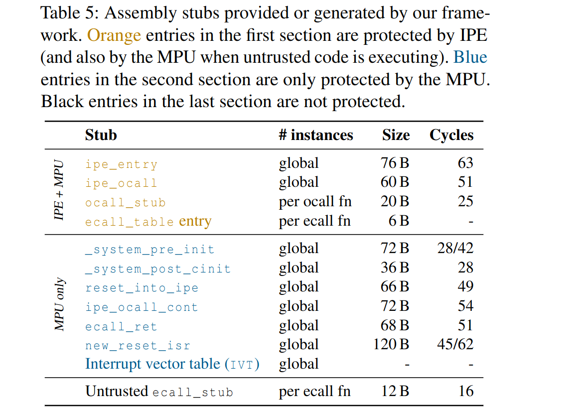

| Stub name         | Calculation                   | Total |
| :---------------- | :------------------------------------ | :---- |
| `ipe_entry`         | -2 + 56 + `mov #ipe_base_stack, &ipe_sp` (4) + `reta` (5) | 63 |
| `ipe_ocall`         | -2 + 46 + `bra #ipe_ocall_cont` (3)   | 47 |
| `ocall_stub`        | ```push r6 (3); push r7 (3); mov #00000000b, r6 (2); mova #signal_done, r7 (3); calla #ipe_ocall (5); pop r7 (2); pop r6 (2); reta (5)``` | 25 |
| | |
| `system_pre_init` (reset_isr_already_switched=0)    | -2 + 25 + `reta` (5)                  | 28 |
| `system_pre_init` (reset_isr_already_switched=1) | -2 + 39 + `reta` (5)                  | 42 |
| `system_post_cinit`         | -2 + 25 + `reta` (5)                  | 28 |
| `reset_into_ipe`        | -2 + 47 + `mov #0xA504, &PMMCTL0` (4) | 49 |
| `ipe_ocall_cont`    | -2 + 48 + `calla r7` (5) + `bra #reset_into_ipe` (3) | 54 |
| `ecall_ret`            | -2 + 48 + `reta` (5)                  | 51 |
| `new_reset_isr` (entering_ipe=0)      | -2 + 42 + `br &old_reset_isr` (5)     | 45 |
| `new_reset_isr` (entering_ipe=1)    | -2 + 61 + `br #ipe_entry` (3)         | 62 |
| | |
| ecall_stub        | ```push r7 (3); mov #0, r7 (1); calla #reset_into_ipe (5); pop r7 (2); reta (5)``` | 16 |

Notes:

* zero_time 2
* reta: MOVA @SP+,PC (5)
* bra: MOVA dst,PC (3)
* br: MOV dst,PC
* pop MOV @SP+,dst
