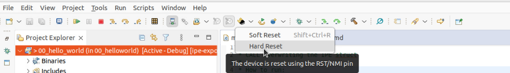
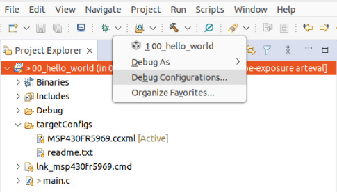

# Intellectual Property Exposure: Subverting and Securing Intellectual Property Encapsulation in Texas Instruments Microcontrollers

This repository contains the code associated with our [IPE Exposure paper](https://mici.hu/papers/bognar24exposure.pdf) to appear at [USENIX Security '24](https://www.usenix.org/conference/usenixsecurity24).

```tex
@inproceedings{bognar24exposure,
  author    = {Bognar, Marton and Magnus, Cas and Piessens, Frank and Van Bulck, Jo},
  title     = {Intellectual Property Exposure: Subverting and Securing {Intellectual Property Encapsulation} in {Texas Instruments} Microcontrollers},
  booktitle = {33rd {USENIX} Security Symposium ({USENIX} Security 24)},
  year      = 2024,
}
```

## Artifact overview

The repository is organized according to the major claims made in the [artifact evaluation appendix](TODO), which we overview below.

| Claim | Paper Ref | Directory | Description |
| :-----| :-------------- | :-------- | :---------- |
| C1 | §3 (Table 1)   | [01_attack_primitives](01_attack_primitives) | Minimal, standalone proof-of-concepts for our basic attack primitives: _(1)_ controlled-call corruption; _(2)_ code-gadget reuse; _(3)_ interrupt register state; _(4)_ cache-timing side channel; _(5)_ interrupt-latency side channel; _(6)_ MPU controlled channel. |
| C2 | §3.4 (Table 4) | [02_covert_channel](02_covert_channel) |  Covert-channel evaluation on the MSP430FR5969. |
| C3 | §4             | [03_end_to_end_attacks](03_end_to_end_attacks) |  End-to-end attack scenarios: _(1)_ overwriting AES key; _(2)_ inserting a leaky gadget; _(3)_ overwriting `ipe_init_struct` to lift protection. |
| C4 | §3.1 | [04_sancus_exploit](sancus_exploit) |  Proof-of-concept controlled-call corruption exploit and mitigation on a modified version of Sancus on openMSP430. | 
| C5 | §6 | [05_framework](05_framework)| Software framework to improve the security of IPE-protected programs and mitigate our attacks. | 
| C6 | §6.4 (Tables 5,7) | [06_benchmarks](06_benchmarks) | Microbenchmark evaluation results + macrobenchmark for protected HACL* HMAC attestation. | 

## Installation and setup instructions

### 1. Clone the repository

If you want to run the Sancus evaluation, make sure to clone the repository with git submodules:

```
$ git clone --recurse-submodules https://github.com/martonbognar/ipe-exposure
```

### 2. Install software dependencies

TI MSP430 development requires the Code Composer Studio (CCS) integrated development
environment, which can be downloaded from the [TI
website](https://www.ti.com/tool/CCSTUDIO#downloads). We used regular CCSTUDIO version 12.6.0, which can be downloaded and installed as follows:

```
$ wget https://dr-download.ti.com/software-development/ide-configuration-compiler-or-debugger/MD-J1VdearkvK/12.6.0/CCS12.6.0.00008_linux-x64.tar.gz
$ tar -xvzf CCS12.6.0.00008_linux-x64.tar.gz
$ cd CCS12.6.0.00008_linux-x64/
$ ./ccs_setup_12.6.0.00008.run # choose ~/ti as installation directory
$ cd ~/ti/ccs1260/ccs/install_scripts/
$ sudo ./install_drivers.sh
```

If you want to use our software mitigation framework, install [`pycparser`](https://github.com/eliben/pycparser) and [`pyelftools`](https://github.com/eliben/pyelftools) as follows:

```shell
$ pip install -r 05_framework/framework/requirements.txt --no-deps
```

### 3. Running a sample CCS project

Individual projects from this repository can be imported in the CCS IDE to load them onto a connected MSP430 development board. Proceed as follows to run a simple "hello world" IPE program:

1. Launch the CCS IDE and create a new workspace in an empty directory when prompted on startup.
2. In CCS, choose `File > Open Projects from File System`. Now select the directory `00_helloworld` in the cloned repository.
3. With the microcontroller connected to the system, start the debug session (F11, :beetle:).
4. After successfully launching the debug session, resume (F8, :arrow_forward:) the program.
5. Expected output should now appear in the Console pane below:
```
----------
Reading secret from main: 1234 (IPE disabled)
Reading secret from IPE : 1234
```
6. In order to activate IPE, we need a hard reset. For this, first pause the running debug session (Alt+F8, :pause_button:), then select "Hard Reset" from the dropdown next to the Reset button (:recycle:):

7. The microcontroller will now reboot with IPE enabled. After resuming (F8, :arrow_forward:) the program, you should see the following output in the Console pane:
```
----------
Reading secret from main: 3fff (IPE enabled)
Reading secret from IPE : 1234
```
8. The CCS debug session can now be terminated via the stop button ( :red_square: ).

#### Troubleshooting

> :bulb: Every project directory contains a README with concise running instructions and expected output (copied from the main source file, usually `main.c`).

* Any Ultra-Low-Power Advisor remarks can be safely ignored by clicking `Proceed`.

* If you get an error about data verification, make sure that `Target > MSP43x Options > On connect, erase main, information, and IP protected area` is enabled in the debug configuration (dropdown next to Debug :beetle: button). This should normally already be the case for all CCS projects in this repository.


